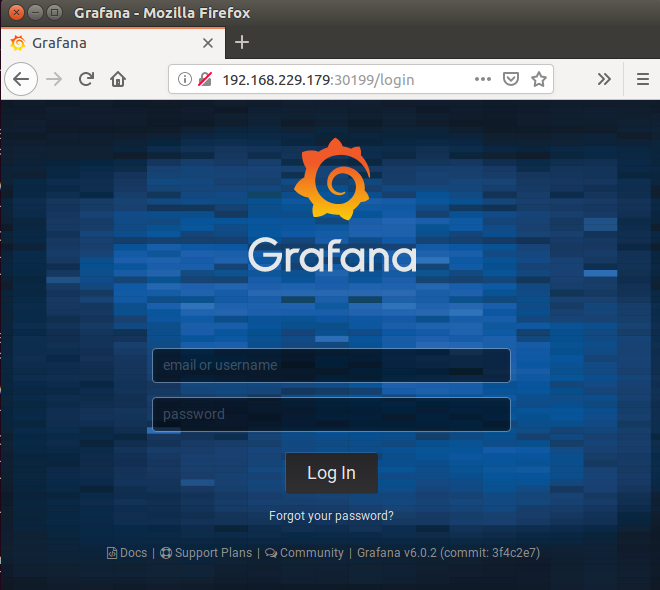
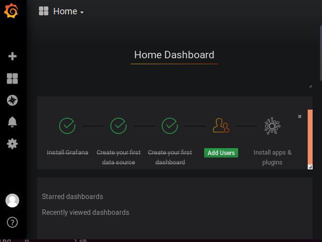
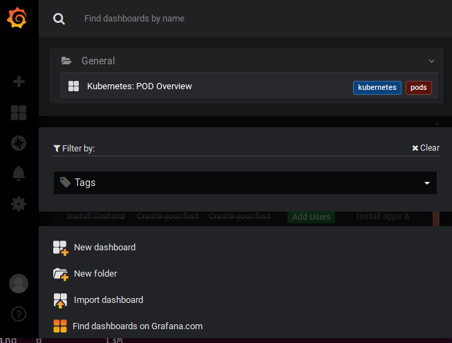
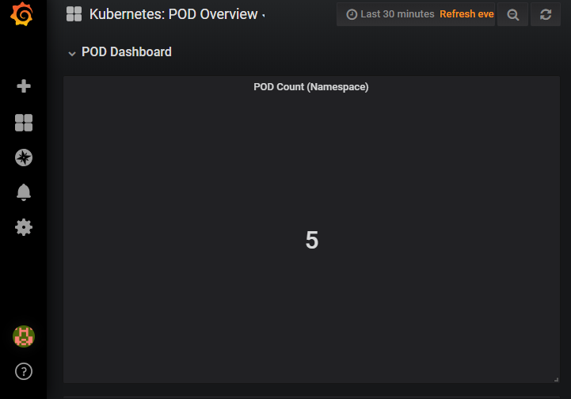

![rx-m LLC][RX-M LLC]


# A Day in the life of a cloud native developer


## Step 06 - Prometheus and Grafana

Prometheus is an open source monitoring and alerting application, often employed to provide application and node-level
metrics monitoring to Cloud Native application deployments. When paired with Grafana, a powerful visualization tool that
meshes well with Prometheus, users are given deep insight into the health of their applications.

Prometheus works by continually collecting, or scraping, open metrics endpoints made available by applications, looking
at any exposed endpoint at /metrics to collect pertinent data. Data can then be sorted inside the Prometheus GUI,
where the user can design queries that can aggregate more useful metrics like averages, sums and histograms.

In this step we'll use helm to deploy Prometheus and other resources needed to monitor applications in K8s.


### 1. Render the Helm Charts

Now run the helm templates for Prometheus under the step06 directory:

```
ubuntu@ip-172-31-18-59:~/kubecon-eu-2019$ helm template ~/kubecon-eu-2019/step06/prometheus/. \
--name cal-172-31-18-59-metrics --set metadata.namespace=cal-172-31-18-59 | kubectl apply -f -

secret/cal-172-31-18-59-metrics-grafana created
configmap/cal-172-31-18-59-metrics-grafana-dashboard-provider created
configmap/cal-172-31-18-59-metrics-grafana-datasource created
configmap/cal-172-31-18-59-metrics-kubernetes-pod-overview-dashboard created
configmap/cal-172-31-18-59-metrics-prometheus-config created
configmap/cal-172-31-18-59-metrics-prometheus-jmx-exporter created
serviceaccount/cal-172-31-18-59-metrics-prometheus created
role.rbac.authorization.k8s.io/cal-172-31-18-59-metrics-prometheus created
rolebinding.rbac.authorization.k8s.io/cal-172-31-18-59-metrics-prometheus created
service/cal-172-31-18-59-metrics-prometheus created
deployment.apps/cal-172-31-18-59-metrics-prometheus created

ubuntu@ip-172-31-18-59:~/kubecon-eu-2019$
```

You render the helm chart with the following options:

  - `--set metadata.namespace=cal-172-31-18-59`- Tells Helm to render each manifest with your namespace
  - `--name cal-172-31-18-59-metrics` - Names the metrics deployment with your initials suffixed by "-metrics"

This ensures that all helm-rendered assets are placed into the right namespace (though with your context set up in
Kubectl, that is optional) and that they're easy to identify.

Once deployed, ensure that the Helm chart elements were
deployed successfully using `kubectl get all`:

```
ubuntu@ip-172-31-18-59:~/kubecon-eu-2019$ kubectl get all

NAME                                                      READY   STATUS    RESTARTS   AGE
pod/cal-172-31-18-59-metrics-prometheus-9bdf95b56-dzngc   4/4     Running   0          108s
pod/cal-172-31-18-59-ossp-67469746c-9mhtp                 1/1     Running   0          10m

NAME                                          TYPE           CLUSTER-IP       EXTERNAL-IP                                                                 PORT(S)                         AGE
service/cal-172-31-18-59-metrics-prometheus   NodePort       10.100.251.109   <none>                                                                      9090:31444/TCP,3000:32491/TCP   108s
service/cal-172-31-18-59-ossp                 LoadBalancer   10.100.101.251   a806b89387ba211e98f95020deaa3a09-548583198.eu-central-1.elb.amazonaws.com   50088:31811/TCP                 10m

NAME                                                  DESIRED   CURRENT   UP-TO-DATE   AVAILABLE   AGE
deployment.apps/cal-172-31-18-59-metrics-prometheus   1         1         1            1           108s
deployment.apps/cal-172-31-18-59-ossp                 1         1         1            1           10m

NAME                                                            DESIRED   CURRENT   READY   AGE
replicaset.apps/cal-172-31-18-59-metrics-prometheus-9bdf95b56   1         1         1       108s
replicaset.apps/cal-172-31-18-59-ossp-67469746c                 1         1         1       10m

ubuntu@ip-172-31-18-59:~/kubecon-eu-2019$
```

Wait a moment while the metrics resources come up and online.


### 2. Accessing Your Metrics

Take a look at the service deployed with your Prometheus Helm chart. It presents four ports numbers in two mappings.
Port 9090 in this example is mapped to 31116, while Port 3000 is mapped to 30199.

```
ubuntu@ip-172-31-18-59:~/kubecon-eu-2019$ kubectl get svc

NAME                                  TYPE           CLUSTER-IP       EXTERNAL-IP                                                                 PORT(S)                         AGE
cal-172-31-18-59-metrics-prometheus   NodePort       10.100.251.109   <none>                                                                      9090:31444/TCP,3000:32491/TCP   2m9s
cal-172-31-18-59-ossp                 LoadBalancer   10.100.101.251   a806b89387ba211e98f95020deaa3a09-548583198.eu-central-1.elb.amazonaws.com   50088:31811/TCP                 11m

ubuntu@ip-172-31-18-59:~/kubecon-eu-2019$
```

To facilitate access to your metrics, the Prometheus service was set to open a NodePort. This means that you can access
your metrics by entering the external IP address or fully qualified domain name of any node in the cluster combined with
the node port. Accessing a worker node on port 9090 in this example will take you to the Prometheus GUI, while
accessing port 3000 takes you to Grafana.

In a browser, enter one of the IP addresses or FQDNs of the Kubernetes worker machines:

```
ubuntu@ip-172-31-18-59:~/kubecon-eu-2019$ kubectl get node -o wide

NAME                                               STATUS   ROLES    AGE   VERSION   INTERNAL-IP       EXTERNAL-IP      OS-IMAGE         KERNEL-VERSION                CONTAINER-RUNTIME
ip-192-168-104-49.eu-central-1.compute.internal    Ready    <none>   12h   v1.12.7   192.168.104.49    35.156.190.95    Amazon Linux 2   4.14.106-97.85.amzn2.x86_64   docker://18.6.1
ip-192-168-117-8.eu-central-1.compute.internal     Ready    <none>   12h   v1.12.7   192.168.117.8     35.159.40.214    Amazon Linux 2   4.14.106-97.85.amzn2.x86_64   docker://18.6.1
ip-192-168-141-101.eu-central-1.compute.internal   Ready    <none>   10h   v1.12.7   192.168.141.101   18.195.161.16    Amazon Linux 2   4.14.106-97.85.amzn2.x86_64   docker://18.6.1
ip-192-168-142-13.eu-central-1.compute.internal    Ready    <none>   10h   v1.12.7   192.168.142.13    54.93.170.136    Amazon Linux 2   4.14.106-97.85.amzn2.x86_64   docker://18.6.1
ip-192-168-158-118.eu-central-1.compute.internal   Ready    <none>   12h   v1.12.7   192.168.158.118   54.93.252.48     Amazon Linux 2   4.14.106-97.85.amzn2.x86_64   docker://18.6.1
ip-192-168-170-113.eu-central-1.compute.internal   Ready    <none>   10h   v1.12.7   192.168.170.113   3.121.215.120    Amazon Linux 2   4.14.106-97.85.amzn2.x86_64   docker://18.6.1
ip-192-168-198-68.eu-central-1.compute.internal    Ready    <none>   12h   v1.12.7   192.168.198.68    18.184.189.118   Amazon Linux 2   4.14.106-97.85.amzn2.x86_64   docker://18.6.1
ip-192-168-244-176.eu-central-1.compute.internal   Ready    <none>   12h   v1.12.7   192.168.244.176   3.122.119.152    Amazon Linux 2   4.14.106-97.85.amzn2.x86_64   docker://18.6.1
ip-192-168-249-81.eu-central-1.compute.internal    Ready    <none>   10h   v1.12.7   192.168.249.81    18.196.108.25    Amazon Linux 2   4.14.106-97.85.amzn2.x86_64   docker://18.6.1
ip-192-168-99-172.eu-central-1.compute.internal    Ready    <none>   10h   v1.12.7   192.168.99.172    3.121.74.226     Amazon Linux 2   4.14.106-97.85.amzn2.x86_64   docker://18.6.1
...

ubuntu@ip-172-31-18-59:~/kubecon-eu-2019$
```



Login to Grafana. The default credentials, which you can set in the Helm chart's Values.yaml file, are as follows:

  - Username: admin
  - Password: kubecon2019eu



Once logged into Grafana, click "Home" to open the Dashboard search. You should see a pre-populated dashboard,
**Kubernetes: POD Overview**:



Select **Kubernetes: POD Overview**:



You will be taken to a very simple dashboard that reports the amount of containers currently reporting Up status to the
cluster's master Prometheus instance.

Its nice to be able to monitor things but we are still missing two legs of the observability stool, tracking logs and
tracing calls, let's start by looking at log management with Fluentd: [../step07/README.md](../step07/README.md)


<br>

Congratulations, you have completed the tutorial step!

<br>

_Copyright (c) 2019 RX-M LLC, Cloud Native Consulting, all rights reserved_

[RX-M LLC]: http://rx-m.io/rxm-cnc.svg "RX-M LLC"
