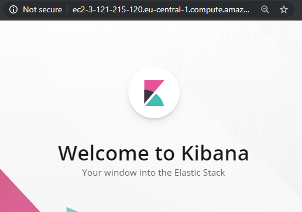
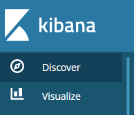
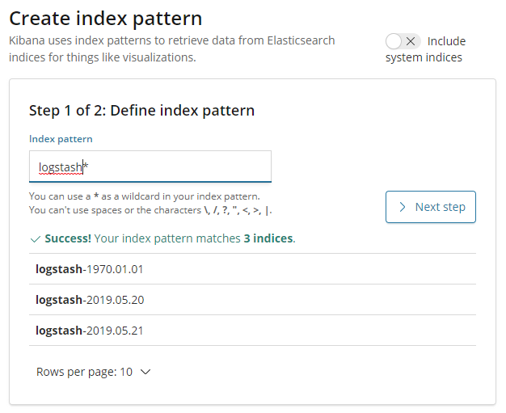
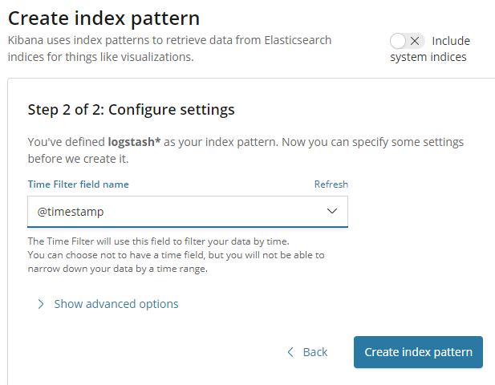
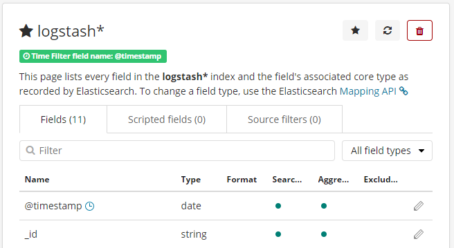
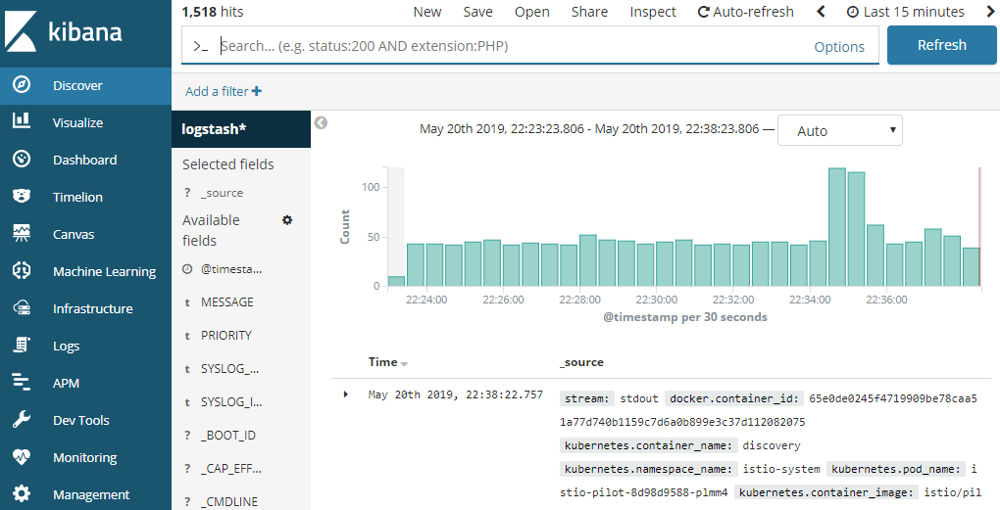
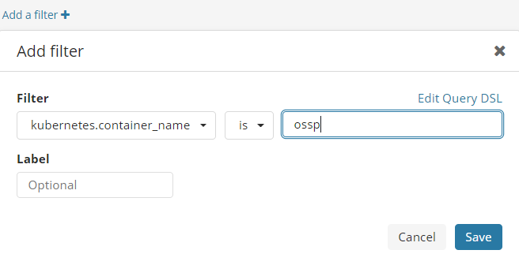
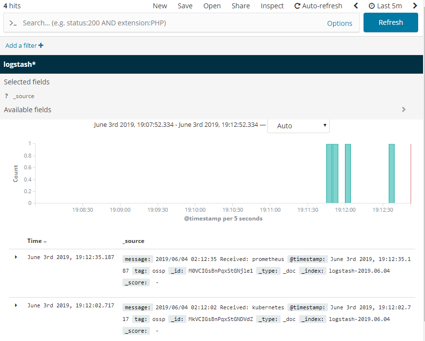

![rx-m LLC][RX-M LLC]

# A Day in the life of a cloud native developer


## Step 07 - Logging with Fluentd

Fluentd is a cross platform open-source data collection tool, having recently graduated it is now a top level CNCF project. Fluentd 
is written primarily in Ruby with C in places where performance is critical.

In this step we'll use Fluentd to take the log events from our microservice and forward them to Elasticsearch where we
can view them with Kibana (this combination of tools is often known as the EFK stack).


### 1. Deploying the Helm Charts

The lab repo includes helm charts that will deploy the EFK stack for you in your personal namespace.

First, deploy Elasticsearch, providing the values.yaml file under this step's elasticsearch directory:

```
ubuntu@ip-172-31-18-59:~/kubecon-eu-2019$ helm template ./step07/elasticsearch/. | kubectl apply -f -

poddisruptionbudget.policy/elasticsearch-master-pdb created
service/elasticsearch-master created
service/elasticsearch-master-headless created
statefulset.apps/elasticsearch-master created

ubuntu@ip-172-31-18-59:~/kubecon-eu-2019$
```

Next, deploy Kibana. Kibana provides a visualization layer for Elasticsearch data, making it an excellent compliment to
any Elasticsearch deployment. This time, pass the --name flag and use the name of your namespace:

```
ubuntu@ip-172-31-18-59:~/kubecon-eu-2019$ helm template ./step07/kibana/. --name cal-172-31-18-59  | kubectl apply -f -

service/cal-172-31-18-59-kibana created
deployment.apps/cal-172-31-18-59-kibana created

ubuntu@ip-172-31-18-59:~/kubecon-eu-2019$
```

Finally, deploy Fluentd. This will allow Kubernetes, and your service, to feed event data into Elasticsearch For this
step, use the `--set metadata.namespace` to your namespace to ensure that all the Fluentd instances start within your
own namespace:

```
ubuntu@ip-172-31-18-59:~/kubecon-eu-2019$ helm template ./step07/fluentd/. \
--name cal-172-31-18-59 --set metadata.namespace=cal-172-31-18-59  | kubectl apply -f -

configmap/cal-172-31-18-59-fluentd-elasticsearch created
serviceaccount/cal-172-31-18-59-fluentd-elasticsearch created
clusterrole.rbac.authorization.k8s.io/cal-172-31-18-59-fluentd-elasticsearch created
clusterrolebinding.rbac.authorization.k8s.io/cal-172-31-18-59-fluentd-elasticsearch created
daemonset.apps/cal-172-31-18-59-fluentd-elasticsearch created

ubuntu@ip-172-31-18-59:~/kubecon-eu-2019$
```

Wait a few minutes for all of your deployed sources to come online, and soon you'll be able to receive data from it.

```
ubuntu@ip-172-31-18-59:~/kubecon-eu-2019$ kubectl get all

NAME                                                      READY   STATUS    RESTARTS   AGE
pod/cal-172-31-18-59-fluentd-elasticsearch-9qh9v          1/1     Running   0          37s
pod/cal-172-31-18-59-fluentd-elasticsearch-fv59v          1/1     Running   0          37s
pod/cal-172-31-18-59-fluentd-elasticsearch-gl2dc          1/1     Running   0          37s
pod/cal-172-31-18-59-fluentd-elasticsearch-mb92n          1/1     Running   0          37s
pod/cal-172-31-18-59-fluentd-elasticsearch-mbxq8          1/1     Running   0          37s
pod/cal-172-31-18-59-fluentd-elasticsearch-nl8w7          1/1     Running   0          37s
pod/cal-172-31-18-59-fluentd-elasticsearch-nvtwx          1/1     Running   0          37s
pod/cal-172-31-18-59-fluentd-elasticsearch-sj5hv          1/1     Running   0          37s
pod/cal-172-31-18-59-fluentd-elasticsearch-x4h22          1/1     Running   0          37s
pod/cal-172-31-18-59-fluentd-elasticsearch-zmmmr          1/1     Running   0          37s
pod/cal-172-31-18-59-kibana-7c7c9df89f-7h5kt              1/1     Running   0          83s
pod/cal-172-31-18-59-metrics-prometheus-9bdf95b56-dzngc   4/4     Running   0          6m46s
pod/cal-172-31-18-59-ossp-67469746c-9mhtp                 1/1     Running   0          15m
pod/elasticsearch-master-0                                1/1     Running   0          106s

NAME                                          TYPE           CLUSTER-IP       EXTERNAL-IP                                                                 PORT(S)                         AGE
service/cal-172-31-18-59-kibana               NodePort       10.100.135.60    <none>                                                                      5601:30892/TCP                  83s
service/cal-172-31-18-59-metrics-prometheus   NodePort       10.100.251.109   <none>                                                                      9090:31444/TCP,3000:32491/TCP   6m46s
service/cal-172-31-18-59-ossp                 LoadBalancer   10.100.101.251   a806b89387ba211e98f95020deaa3a09-548583198.eu-central-1.elb.amazonaws.com   50088:31811/TCP                 15m
service/elasticsearch-master                  ClusterIP      10.100.225.68    <none>                                                                      9200/TCP,9300/TCP               106s
service/elasticsearch-master-headless         ClusterIP      None             <none>                                                                      9200/TCP                        106s

NAME                                                    DESIRED   CURRENT   READY   UP-TO-DATE   AVAILABLE   NODE SELECTOR   AGE
daemonset.apps/cal-172-31-18-59-fluentd-elasticsearch   10        10        10      10           10          <none>          37s

NAME                                                  DESIRED   CURRENT   UP-TO-DATE   AVAILABLE   AGE
deployment.apps/cal-172-31-18-59-kibana               1         1         1            1           83s
deployment.apps/cal-172-31-18-59-metrics-prometheus   1         1         1            1           6m46s
deployment.apps/cal-172-31-18-59-ossp                 1         1         1            1           15m

NAME                                                            DESIRED   CURRENT   READY   AGE
replicaset.apps/cal-172-31-18-59-kibana-7c7c9df89f              1         1         1       83s
replicaset.apps/cal-172-31-18-59-metrics-prometheus-9bdf95b56   1         1         1       6m46s
replicaset.apps/cal-172-31-18-59-ossp-67469746c                 1         1         1       15m

NAME                                    DESIRED   CURRENT   AGE
statefulset.apps/elasticsearch-master   1         1         106s

ubuntu@ip-172-31-18-59:~/kubecon-eu-2019$
```


### 2. Generating Events

Using your `client.go` program to hit the gRPC microservice, send some events corresponding to some of the growing number
of graduated CNCF projects:

```
ubuntu@ip-172-31-18-59:~/kubecon-eu-2019$ go run client.go a806b89387ba211e98f95020deaa3a09-548583198.eu-central-1.elb.amazonaws.com fluentd

2019/05/21 08:45:31 Projects: name:"fluentd" custodian:"cncf"

ubuntu@ip-172-31-18-59:~/kubecon-eu-2019$ go run client.go a806b89387ba211e98f95020deaa3a09-548583198.eu-central-1.elb.amazonaws.com containerd

2019/05/21 08:45:38 Projects: name:"containerd" custodian:"cncf"

ubuntu@ip-172-31-18-59:~/kubecon-eu-2019$ go run client.go a806b89387ba211e98f95020deaa3a09-548583198.eu-central-1.elb.amazonaws.com prometheus

2019/05/21 08:45:45 Projects: name:"prometheus" custodian:"cncf"

ubuntu@ip-172-31-18-59:~/kubecon-eu-2019$ go run client.go a806b89387ba211e98f95020deaa3a09-548583198.eu-central-1.elb.amazonaws.com kubernetes

2019/05/21 08:45:52 Projects: name:"kubernetes" custodian:"cncf"

ubuntu@ip-172-31-18-59:~/kubecon-eu-2019$
```

After generating some traffic, examine the logs from each of your ossp deployment pods:

```
ubuntu@ip-172-31-18-59:~/kubecon-eu-2019$ kubectl logs pod/cal-172-31-18-59-ossp-67469746c-9mhtp

2019/05/21 08:31:25 Received: fluentd
2019/05/21 08:45:31 Received: fluentd
2019/05/21 08:45:38 Received: containerd
2019/05/21 08:45:45 Received: prometheus
2019/05/21 08:45:52 Received: kubernetes

ubuntu@ip-172-31-18-59:~/kubecon-eu-2019$
```

Keep these events in mind, you will see them again in a more colorful way in the next step.


### 3. Visualizing log data

With events sent Elasticsearch through Fluentd, you can now use Kibana to check the events that are coming in from all
parts of your Kubernetes cluster (within your namespace).

Kibana was deployed with a NodePort service, meaning that you can access it visiting the URL of any of the Kubernetes
workers at your own port.

Retrieve the nodeport for Kibana with `kubectl get svc`:

```
ubuntu@ip-172-31-18-59:~/kubecon-eu-2019$ kubectl get svc

NAME                                  TYPE           CLUSTER-IP       EXTERNAL-IP                                                                 PORT(S)                         AGE
cal-172-31-18-59-kibana               NodePort       10.100.135.60    <none>                                                                      5601:30892/TCP                  8m33s
cal-172-31-18-59-metrics-prometheus   NodePort       10.100.251.109   <none>                                                                      9090:31444/TCP,3000:32491/TCP   13m
cal-172-31-18-59-ossp                 LoadBalancer   10.100.101.251   a806b89387ba211e98f95020deaa3a09-548583198.eu-central-1.elb.amazonaws.com   50088:31811/TCP                 22m
elasticsearch-master                  ClusterIP      10.100.225.68    <none>                                                                      9200/TCP,9300/TCP               8m56s
elasticsearch-master-headless         ClusterIP      None             <none>                                                                      9200/TCP                        8m56s

ubuntu@ip-172-31-18-59:~/kubecon-eu-2019$
```

Here, you can see that Kibana has routed its port, 5601, to port 30892 on the cluster.

Pick one of the External IP addresses from the list of available worker nodes retrieved by `kubectl get nodes -o wide`:

```
ubuntu@ip-172-31-18-59:~/kubecon-eu-2019$ kubectl get nodes -o wide

NAME                                               STATUS   ROLES    AGE   VERSION   INTERNAL-IP       EXTERNAL-IP      OS-IMAGE         KERNEL-VERSION                CONTAINER-RUNTIME
ip-192-168-104-49.eu-central-1.compute.internal    Ready    <none>   12h   v1.12.7   192.168.104.49    35.156.190.95    Amazon Linux 2   4.14.106-97.85.amzn2.x86_64   docker://18.6.1
ip-192-168-117-8.eu-central-1.compute.internal     Ready    <none>   12h   v1.12.7   192.168.117.8     35.159.40.214    Amazon Linux 2   4.14.106-97.85.amzn2.x86_64   docker://18.6.1
ip-192-168-141-101.eu-central-1.compute.internal   Ready    <none>   10h   v1.12.7   192.168.141.101   18.195.161.16    Amazon Linux 2   4.14.106-97.85.amzn2.x86_64   docker://18.6.1
ip-192-168-142-13.eu-central-1.compute.internal    Ready    <none>   10h   v1.12.7   192.168.142.13    54.93.170.136    Amazon Linux 2   4.14.106-97.85.amzn2.x86_64   docker://18.6.1
ip-192-168-158-118.eu-central-1.compute.internal   Ready    <none>   12h   v1.12.7   192.168.158.118   54.93.252.48     Amazon Linux 2   4.14.106-97.85.amzn2.x86_64   docker://18.6.1
...

ubuntu@ip-172-31-18-59:~/kubecon-eu-2019$
```

In your browser window, enter one of the external IP address or FQDN of one of the Kubernetes worker nodes with your
Kibana port. You should be brought to the Kibana welcome page.



Click "Explore on my Own":


Go to Discover:



You will be prompted to create an index pattern. Kibana needs to be aware of all indices within Elasticsearch so it can
formulate effective queries against them to better visualize data. There should be some indices starting with `logstash`
already present.

The EFK stack is actually an alternative to the ELK (Elasticsearch, Logstash, and Kibana). The only difference is that
Fluentd takes Logstash's place. By default, Fluentd's Elasticsearch plugin will make it act identical to Logstash, thus
causing Fluentd to send all events in the same manner as logstash would.

Type "logstash" into the Index Pattern text box:



If Kibana reports "Success! Your index pattern matches ...," click the `> Next step` button:

You will next be prompted to select a time filter. This allows Kibana to designate a field within a Fluentd event as a
sortable time field.

In the dropdown, you will find @timestamp available as a choice, so select it:



That's it. Click `Create index pattern`. Once it finishes, you should see an index with all the fields:



In the left menu bar, click `Discover` again:



You should now see that Kibana has data in it! It's quite a lot, so try to filter it down. Try to find the events you
sent to the OSSP program earlier.

Click `Add a filter +`:



Select the following:

- kubernetes.container_name is ossp
- kubernetes.namespace_name is `<Your Namespace>`

And in the top search bar, look for **received**:



You should now see your GRPC service's logs in Kibana! Take a minute to look around; with its current setting Fluentd is
capture all activity coming to all containers within your namespace.

One more piece of the observability triad to go, tracing application calls with Istio:
[../step08/README.md](../step08/README.md)


<br>

Congratulations, you have completed the tutorial step!

<br>

_Copyright (c) 2019 RX-M LLC, Cloud Native Consulting, all rights reserved_

[RX-M LLC]: http://rx-m.io/rxm-cnc.svg "RX-M LLC"
