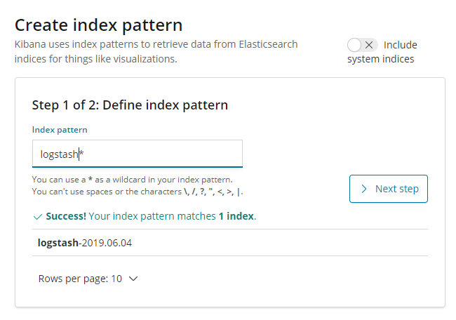

![rx-m LLC][RX-M LLC]

# A Day in the life of a cloud native developer


## Step 07 - Logging with Fluentd

Fluentd is a cross platform open-source data collection software project recently graduated and a top level project at
the CNCF. Fluentd is written primarily in Ruby with C in places where performance is critical.

In this step we'll use Fluentd to take the log events from our microservice and forward them to Elasticsearch where we
can view them with Kibana (the infamous EFK stack).


### 1. Deploying the Helm Charts

The lab repo includes helm charts that will deploy the EFK stack for you in your personal namespace.

First, deploy Elasticsearch, providing the values.yaml file under this step's elasticsearch directory:

```
ubuntu@labsys:~/kubecon-eu-2019$ helm template ./step07/elasticsearch/. | kubectl create -f -

poddisruptionbudget.policy/elasticsearch-master-pdb created
service/elasticsearch-master created
service/elasticsearch-master-headless created
pod/release-name-subfz-test created
statefulset.apps/elasticsearch-master created

ubuntu@labsys:~/kubecon-eu-2019$
```

Next, deploy Kibana. Kibana provides a visualization layer for Elasticsearch data, making it an excellent compliment to
any Elasticsearch deployment.

```
ubuntu@labsys:~/kubecon-eu-2019$ helm template ./step07/kibana/. | kubectl create -f -

service/release-name-kibana created
deployment.apps/release-name-kibana created

ubuntu@labsys:~/kubecon-eu-2019$
```

Finally, deploy Fluentd. This will allow Kubernetes, and your service, to feed event data into Elasticsearch:

```
ubuntu@labsys:~/kubecon-eu-2019$ helm template ./step07/fluentd/. | kubectl create -f -

configmap/release-name-fluentd-elasticsearch created
serviceaccount/release-name-fluentd-elasticsearch created
clusterrole.rbac.authorization.k8s.io/release-name-fluentd-elasticsearch created
clusterrolebinding.rbac.authorization.k8s.io/release-name-fluentd-elasticsearch created
daemonset.apps/release-name-fluentd-elasticsearch created

ubuntu@labsys:~/kubecon-eu-2019$
```

Wait a few minutes for all of your deployed sources to come online, and soon you'll be able to receive data from it.


### 2. Generating Events

Using your `client.go` program to hit the gRPC microservice, send some events corresponding to some of the growing number
of graduated CNCF projects:

```
ubuntu@labsys:~/kubecon-eu-2019$ go run client.go a8e148a6d7b8511e981790ae78cda592-2011153213.eu-central-1.elb.amazonaws.com fluentd

2019/05/20 22:15:01 Projects: name:"fluentd" custodian:"cncf"

ubuntu@labsys:~/kubecon-eu-2019$ go run client.go a8e148a6d7b8511e981790ae78cda592-2011153213.eu-central-1.elb.amazonaws.com containerd

2019/05/20 22:22:26 Projects: name:"containerd" custodian:"cncf"

ubuntu@labsys:~/kubecon-eu-2019$ go run client.go a8e148a6d7b8511e981790ae78cda592-2011153213.eu-central-1.elb.amazonaws.com prometheus

2019/05/20 22:22:32 Projects: name:"prometheus" custodian:"cncf"

ubuntu@labsys:~/kubecon-eu-2019$ go run client.go a8e148a6d7b8511e981790ae78cda592-2011153213.eu-central-1.elb.amazonaws.com kubernetes

2019/05/20 22:22:38 Projects: name:"kubernetes" custodian:"cncf"

ubuntu@labsys:~/kubecon-eu-2019$
```

Once you're done sending them, grab the logs from each of your ossp deployment pods:

```
ubuntu@labsys:~/kubecon-eu-2019$ kubectl logs ossp-67469746c-4z6k6

2019/05/21 05:15:01 Received: fluentd
2019/05/21 05:22:26 Received: containerd
2019/05/21 05:22:38 Received: kubernetes

ubuntu@labsys:~/kubecon-eu-2019$ kubectl logs ossp-67469746c-slxrz

2019/05/21 05:22:32 Received: prometheus

ubuntu@labsys:~/kubecon-eu-2019$
```

Keep these events in mind, you will see them again in a more colorful way in the next step.


### 3. Visualizing log data

With events sent Elasticsearch through Fluentd, you can now use Kibana to check the events that are coming in from all parts of your Kubernetes cluster (within your namespace).

Kibana was deployed with a NodePort service, meaning that you can access it visiting the URL of any of the Kubernetes workers at your own port.

Retrieve the nodeport for Kibana with `kubectl get svc`:

```
ubuntu@labsys:~/kubecon-eu-2019$ kubectl get svc

NAME                            TYPE           CLUSTER-IP      EXTERNAL-IP                                                                  PORT(S)                         AGE
elasticsearch-master            ClusterIP      10.100.204.85   <none>                                                                       9200/TCP,9300/TCP               4m57s
elasticsearch-master-headless   ClusterIP      None            <none>                                                                       9200/TCP                        4m57s
ossp-service                    LoadBalancer   10.100.106.2    a8e148a6d7b8511e981790ae78cda592-2011153213.eu-central-1.elb.amazonaws.com   50088:31113/TCP                 8m6s
release-name-kibana             NodePort       10.100.122.3    <none>                                                                       5601:32188/TCP                  114s
release-name-ossp               LoadBalancer   10.100.91.199   a8eece37d7b7b11e981790ae78cda592-1017632840.eu-central-1.elb.amazonaws.com   50088:30691/TCP                 79m
release-name-prometheus         NodePort       10.100.50.212   <none>                                                                       9090:31294/TCP,3000:32515/TCP   155m

ubuntu@labsys:~/kubecon-eu-2019$
```

Here, you can see that Kibana has routed its port, 5601, to port 32536 on the cluster.

In your browser window, enter one of the external IP address or FQDN of one of the Kubernetes worker nodes with your
port. You should be brought to the Kibana welcome page.


Click "Explore on my Own":


Go to Discover:


You will be prompted to create an index pattern. Kibana needs to be aware of all indicies within Elasticsearch so it can
formulate effective queries against them to better visualize data. There should be some indices starting with `logstash`
already present.

The EFK stack is actually an alternative to the ELK (Elasticsearch, Logstash, and Kibana). The only difference is that
Fluentd takes Logstash's place. By default, Fluentd's Elasticsearch plugin will make it act identical to Logstash, thus
causing Fluentd to send all events in the same manner as logstash would.

Type "logstash" into the Index Pattern text box:



If Kibana reports "Success! Your index pattern matches ...," click the `> Next step` button:


You will next be prompted to select a time filter. This allows Kibana to designate a field within a Fluentd event as a
sortable time field.

In the dropdown, you will find @timestamp available as a choice, so select it:


That's it. Click `Create index pattern`. Once it finishes, you should see an index with all the fields:


In the left menu bar, click `Discover` again:


You should now see that Kibana has data in it! It's quite a lot, so try to filter it down. Try to find the events you sent to the OSSP program earlier.

Click `Add a filter +`:


Select the following:

- kuberntes.container_name is ossp
- kubernetes.namespace_name is `<Your Namespace>`

And in the top search bar, look for **received**:


You should now see your GRPC service's logs in Kibana! Take a minute to look around; with its current setting Fluentd is
capture all activity coming to all containers within your namespace.

One more piece of the observability triad to go, tracing application calls with Istio:
[../step08/README.md](../step08/README.md)


<br>

Congratulations, you have completed the tutorial step!

<br>

_Copyright (c) 2019 RX-M LLC, Cloud Native Consulting, all rights reserved_

[RX-M LLC]: http://rx-m.io/rxm-cnc.svg "RX-M LLC"
